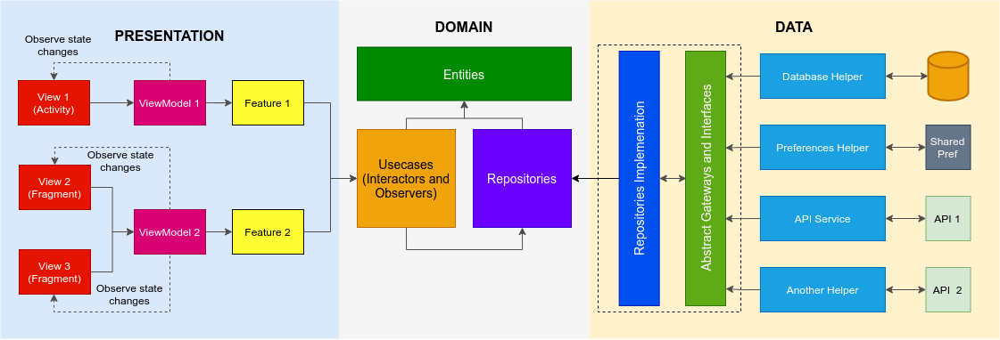

# PrivacyCentral Development Guide
This guide contains development related information to help a developer in getting better understanding of project structure.

## Architecture
The architecture of PrivacyCentralApp is based on [clean architecture](https://blog.cleancoder.com/uncle-bob/2012/08/13/the-clean-architecture.html). For presentation layer, we use  [Model-View-Intent](http://hannesdorfmann.com/android/model-view-intent/) design pattern which is a unidirectional reactive flow pattern. We use it in conjunction to ViewModel to make our features lifecycle aware. Our android app is having single activity multiple fragments.

### Clean Architecture
Clean architecture is the building block of PrivacyCentralApp. This architecture is based on the following principles:
1. **Independent of Frameworks**. The architecture does not depend on the existence of some library of feature laden software. This allows you to use such frameworks as tools, rather than having to cram your system into their limited constraints.
2. **Testable**. The business rules can be tested without the UI, Database, Web Server, or any other external element.
3. **Independent of UI**. The UI can change easily, without changing the rest of the system. A Web UI could be replaced with a console UI, for example, without changing the business rules.
4. **Independent of Database**. You can swap out Oracle or SQL Server, for Mongo, BigTable, CouchDB, or something else. Your business rules are not bound to the database.
5. **Independent of any external agency**. In fact your business rules simply don’t know anything at all about the outside world.


### Model-View-Intent


MVI is used at the presentation layer of clean architecture. It is very much similar to [Redux](https://redux.js.org/) in terms of implementation and working. It has three main components.
- **View**: This is where activities, fragments and other android components live. It is responsible for publishing user intent/actions to the model and rendering the state returned by the model. In PrivacyCentralApp, it is just an interface which is implemented by android components.
- **Intent**: In context of our app, we call them actions. These are simple data classes having any extra payload like inputs, ids etc.
- **Model (data layer at presentation level)**: This is responsible for processing the actions, communicating with domain use-cases and mutating the state of the model. It acts as a Store from redux but for our use case, we call it a **Feature**.

#### Flow-MVI in Privacy Central App
In this app, we have implemented MVI using [Kotlin Flow](https://kotlinlang.org/docs/flow.html).


Elements of a feature:
1. **Actor**: It is just a function that takes current state, user action as input and produces an effect (result) as output. This function generally makes the call to external APIs and usecases.
2. **Reducer**: It is also a very simple function whose inputs are current state, effect from the actor and it returns new state.
3. **State**: Simple POJO (kotlin data class) representing various UI states of the application.
4. **Effect**: A POJO (kotlin data class) which is returned from the actor function.
5. **SingleEventProducer**: This is a function which is invoked by the reducer to publish single events (that can/should only be consumed once like displaying toast, snackbar message or sending an analytics event). This function takes action, effect, current state as input and it returns a `SingleEvent`. By default this function is null for any Feature.

### Architecture Overview of PrivacyCentral App



Looking at the diagram from right to left:
1. **Database, Preferences and API Helpers**: These are a set of classes with very specific responsibilities for each of them. They can perform some business logic, communicate with the database or make a call to third party API. These classes are implementation of abstract gateways and interfaces (see below).
2. **Abstract Gateways and Interfaces**: An abstraction layer that sits between repositories and framework implementations. The objective of this layer is to keep repositories independent from framework (like databases).
3. **Respositoy Implementation**: These classes provide the implementation of abstract repository defined in the domain.
4. **Repository**: They are the core part of our domain. Each repository is a just an interface whose implementation is provided by the data layer.
5. **Usecase/Interactors/Observers**: The act as the bridge between the presentation layer and data layer.
6. **Entities**: These are business objects for the application. They encapsulate the most general and high-level rules. They are the least likely to change when something external changes.
7. **Features**: MVI specific model (discussed above).
8. **ViewModel**: arch-component lifecycle aware viewmodel.
9. **Views**: Android high level components like activities, fragments, etc.

## How to implement a new feature
Imaging you have to implement a fake location feature.
1. Create a new package under `features` called `fakelocation`
2. Create a new feature class called `FakeLocationFeature` and make it extend the BaseFeature class as below:
```kotlin
class FakeLocationFeature(
    initialState: State,
    coroutineScope: CoroutineScope,
    reducer: Reducer<State, Effect>,
    actor: Actor<State, Action, Effect>,
    singleEventProducer: SingleEventProducer<State, Action, Effect, SingleEvent>
) : BaseFeature<FakeLocationFeature.State, FakeLocationFeature.Action, FakeLocationFeature.Effect, FakeLocationFeature.SingleEvent>(
    initialState,
    actor,
    reducer,
    coroutineScope,
    { message -> Log.d("FakeLocationFeature", message) },
    singleEventProducer
) {
    // Other elements goes here.
}
```

3. Define various elements for the feature in the above class
```kotlin
// State to be reflected in the UI
data class State(val location: Location)

// User triggered actions
sealed class Action {
    data class UpdateLocationAction(val latLng: LatLng) : Action()
    object UseRealLocationAction : Action()
    object UseSpecificLocationAction : Action()
    data class SetFakeLocationAction(val latitude: Double, val longitude: Double) : Action()
}

// Output from the actor after processing an action
sealed class Effect {
        data class LocationUpdatedEffect(val latitude: Double, val longitude: Double) : Effect()
        object RealLocationSelectedEffect : Effect()
        ...
        ...
        data class ErrorEffect(val message: String) : Effect()
}
```

4. Create a static `create` function in feature which returns the feature instance:
```kotlin
companion object {
        fun create(
            initialState: State = <initial state>
            coroutineScope: CoroutineScope
        ) = FakeLocationFeature(
            initialState, coroutineScope,
            reducer = { state, effect ->
                when (effect) {
                    Effect.RealLocationSelectedEffect -> state.copy(
                        location = state.location.copy(
                            mode = LocationMode.REAL_LOCATION
                        )
                    )
                    is Effect.ErrorEffect, Effect.SpecificLocationSavedEffect -> state
                    is Effect.LocationUpdatedEffect -> state.copy(
                        location = state.location.copy(
                            latitude = effect.latitude,
                            longitude = effect.longitude
                        )
                    )
                }
            },
            actor = { _, action ->
                when (action) {
                    is Action.UpdateLocationAction -> flowOf(
                        Effect.LocationUpdatedEffect(
                            action.latLng.latitude,
                            action.latLng.longitude
                        )
                    )
                    is Action.SetFakeLocationAction -> {
                        val location = Location(
                            LocationMode.CUSTOM_LOCATION,
                            action.latitude,
                            action.longitude
                        )
                        // TODO: Call fake location api with specific coordinates here.
                        val success = DummyDataSource.setLocationMode(
                            LocationMode.CUSTOM_LOCATION,
                            location
                        )
                        if (success) {
                            flowOf(
                                Effect.SpecificLocationSavedEffect
                            )
                        } else {
                            flowOf(
                                Effect.ErrorEffect("Couldn't select location")
                            )
                        }
                    }
                    Action.UseRealLocationAction -> {
                        // TODO: Call turn off fake location api here.
                        val success = DummyDataSource.setLocationMode(LocationMode.REAL_LOCATION)
                        if (success) {
                            flowOf(
                                Effect.RealLocationSelectedEffect
                            )
                        } else {
                            flowOf(
                                Effect.ErrorEffect("Couldn't select location")
                            )
                        }
                    }
                    Action.UseSpecificLocationAction -> {
                        flowOf(Effect.SpecificLocationSelectedEffect)
                    }
                }
            },
            singleEventProducer = { _, _, effect ->
                when (effect) {
                    Effect.SpecificLocationSavedEffect -> SingleEvent.SpecificLocationSavedEvent
                    Effect.RealLocationSelectedEffect -> SingleEvent.RealLocationSelectedEvent
                    is Effect.ErrorEffect -> SingleEvent.ErrorEvent(effect.message)
                    else -> null
                }
            }
        )
    }
```

5. Create a `viewmodel` like below:
```kotlin
class FakeLocationViewModel : ViewModel() {

    private val _actions = MutableSharedFlow<FakeLocationFeature.Action>()
    val actions = _actions.asSharedFlow()

    val fakeLocationFeature: FakeLocationFeature by lazy {
        FakeLocationFeature.create(coroutineScope = viewModelScope)
    }

    fun submitAction(action: FakeLocationFeature.Action) {
        viewModelScope.launch {
            _actions.emit(action)
        }
    }
}
```

6. Create a `fragment` for your feature and make sure it implements `MVIView<>` interface
7. Initialize (or retrieve the existing) instance of viewmodel in your `fragment` class by using extension function.
```kotlin
private val viewModel: FakeLocationViewModel by viewModels()
```

8. In `onCreate` method of fragment, launch a coroutine to bind the view to feature and to listen single events.
```kotlin
override fun onCreate(savedInstanceState: Bundle?) {
    super.onCreate(savedInstanceState)
    lifecycleScope.launchWhenStarted {
        viewModel.fakeLocationFeature.takeView(this, this@FakeLocationFragment)
    }
    lifecycleScope.launchWhenStarted {
        viewModel.fakeLocationFeature.singleEvents.collect { event ->
              // Do something with event
        }
    }
}
```

9. To render the state in UI, override the `render` function of MVIView.
10. For publishing ui actions, use `viewModel.submitAction(action)`.

Everything is lifecycle aware so we don't need to anything manually here.
## Code Quality and Style
This project integrates a combination of unit tests, functional test and code styling tools.
To run **unit** tests on your machine:
```
./gradlew test
```

To run code style check and formatting tool:
```
./gradlew spotlessCheck
./gradlew spotlessApply
```

## State-of-The-Art
The project currently doesn't have exactly the same mentioned structure as it is just a POC and will be improved.

### Todo/Improvements
- [ ] Add domain layer with usecases.
- [ ] Add data layer with repository implementation.
- [ ] Add unit tests and code coverage.
- [ ] Implement Hilt DI.

# References
1. [Kotlin Flow](https://kotlinlang.org/docs/flow.html)
2. [MVI](https://hannesdorfmann.com/android/mosby3-mvi-1/)
3. [Redux](https://redux.js.org/)
4. [Clean Architecture](https://blog.cleancoder.com/uncle-bob/2012/08/13/the-clean-architecture.html)